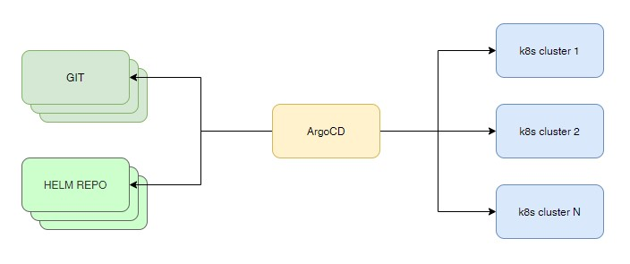

# Argo CD

[Документация](https://argo-cd.readthedocs.io/en/stable/)

## Установка

    # curl -o install.yaml https://raw.githubusercontent.com/argoproj/argo-cd/v2.0.1/manifests/install.yaml

Я разбил это файл на два: argocd-crd.yaml и argocd-app.yaml. В первом файле находятся CRD. Его менять не будем.

Во втором файле будем изменять аргументы командной строки.

    # kubectl -n argocd apply -f https://raw.githubusercontent.com/telman-devops/k00s/master/argocd/argocd-crd.yaml
    # kubectl -n argocd apply -f https://raw.githubusercontent.com/telman-devops/k00s/master/argocd/argo-app.yaml

Добавляем ingress

    # kubectl apply -f 01-ingress.yaml

## Установка CLI

    # curl -sSL -o /usr/local/bin/argocd https://github.com/argoproj/argo-cd/releases/download/v2.0.1/argocd-linux-amd64
    # chmod +x /usr/local/bin/argocd
    # argocd version

## Пароль админа

    # kubectl -n argocd get secret argocd-initial-admin-secret -o jsonpath="{.data.password}" | base64 -d ; echo
    # argocd login argocd.telman.io:443 --grpc-web
    # argocd account update-password --grpc-web

## Добавление пользователя

Добавляем пользователя в argocd-cm

    # kubectl apply -f 02-argocd-cm.yaml

Добавляем пользователю роль админа в argocd-rbac-cm

    # kubectl apply -f 03-argocd-rbac-cm.yaml

Затем в командной строке получаем список

    # argocd account list --grpc-web

    # argocd account update-password --account telman --grpc-web
    *** Enter current password:        <---- admin password
    *** Enter new password:
    *** Confirm new password:
    Password updated

Логинимся новым пользователем в систему

    # argocd login argocd.telman.io:443 --grpc-web
    # argocd cluster list

Заходим в WEB интерфейс

    https://argocd.telman.io
